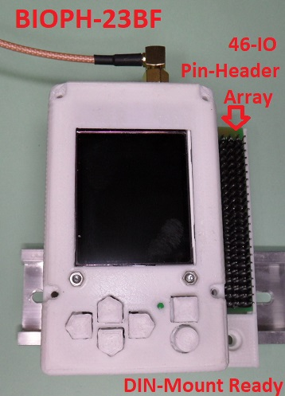
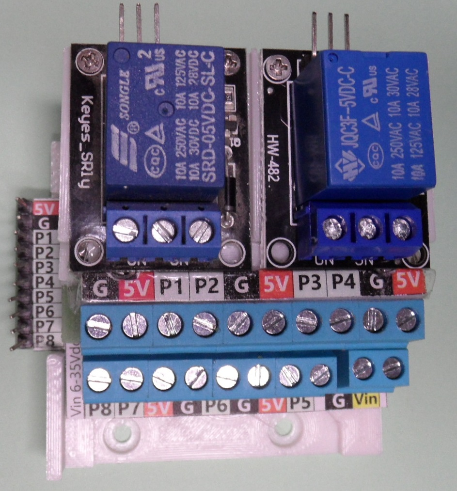
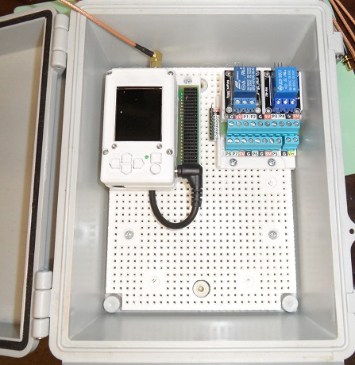

-----------------------------------------------------------------------------------
# Tode-IO (Part of the Tode-RC Project)
-----------------------------------------------------------------------------------
Various Input/Output (IO) accessibility hardware for a Tode-RC.

Visit https://github.com/TGit-Tech/Tode-RC

-----------------------------------------------------------------------------------
# Models
-----------------------------------------------------------------------------------
- Tode-ACCESSORY
	- Mounting Plates for 8.7x6.7x4.3 Project Boxes
	- Pole Mount Antenna Bracket

- Tode-BIOPH (Back-IO Pin Header)\

- Tode-IOSTB (IO Screw Terminal Block)\

