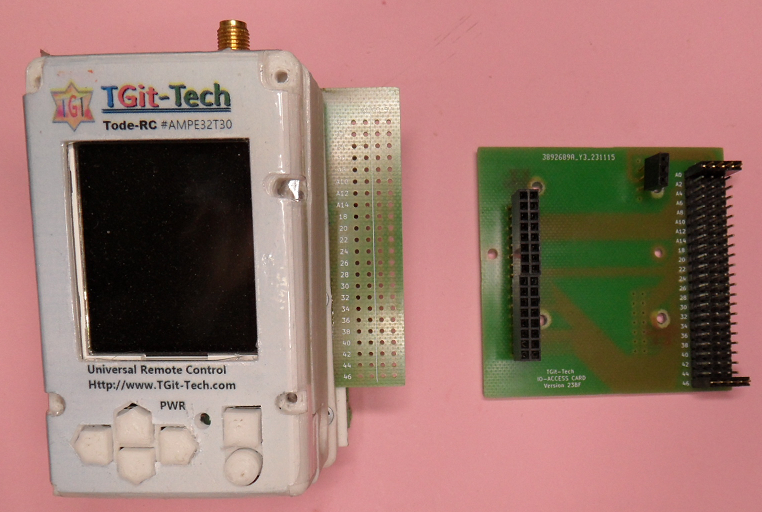
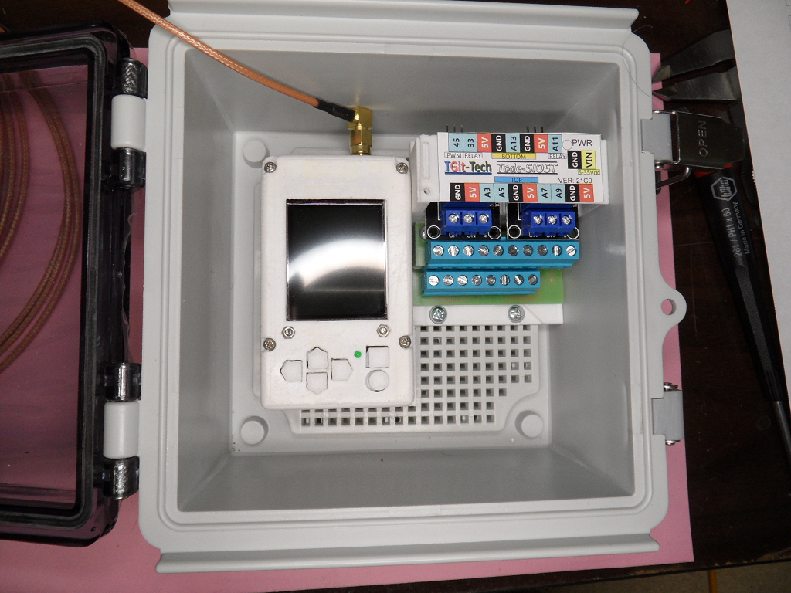
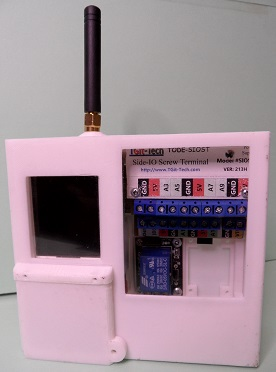

-----------------------------------------------------------------------------------
# Tode-IO (Part of the Tode-RC Project)
-----------------------------------------------------------------------------------
Various Input/Output (IO) accessibility hardware for a Tode-RC.

Visit https://github.com/TGit-Tech/Tode-RC

-----------------------------------------------------------------------------------
# Models
-----------------------------------------------------------------------------------
- Tode-ANT ([ANT]enna Mouting Hardware)

- Tode-BIO WORK-IN-PROGRESS - incomplete ([B]ack-[IO])
	- Project will give access to all un-used Arduino Mega Pins

- (2) Tode-SIOST options ([S]ide-[IO] [S]crew [T]erminal Block)

- Tode-SIOST-CB ([C]ommercial [B]ox - Joinfworld 6x6x4)

- Tode-SIOST-3DB ([3D]-Printed [B]ox)

